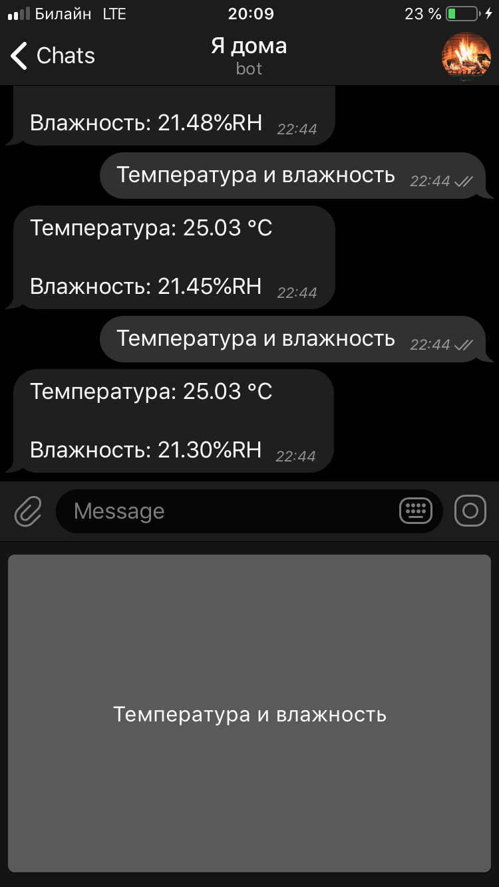
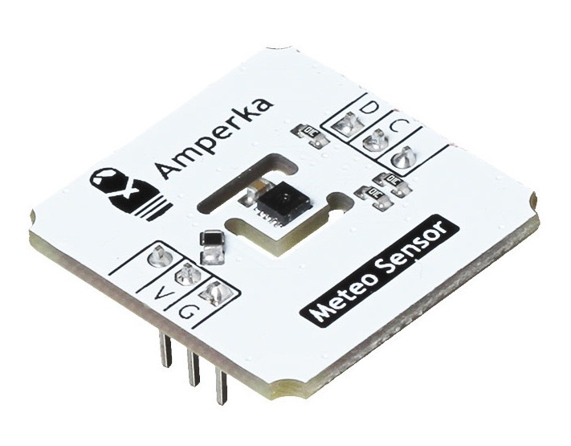
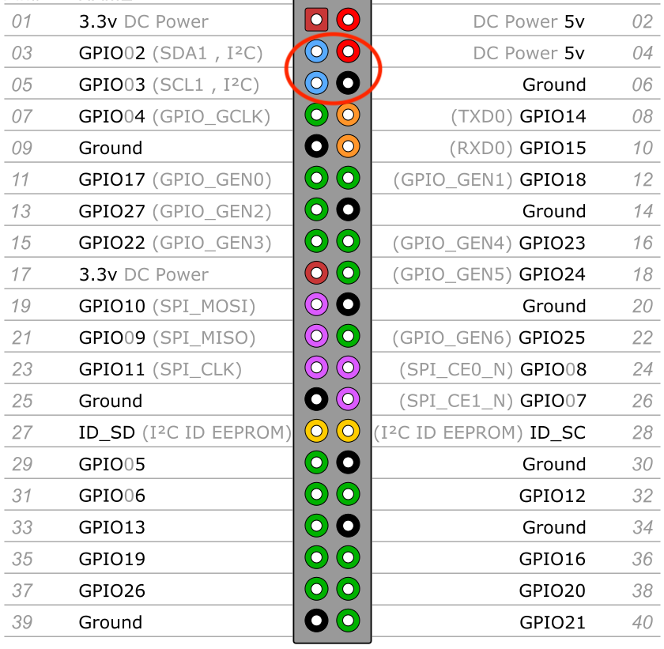
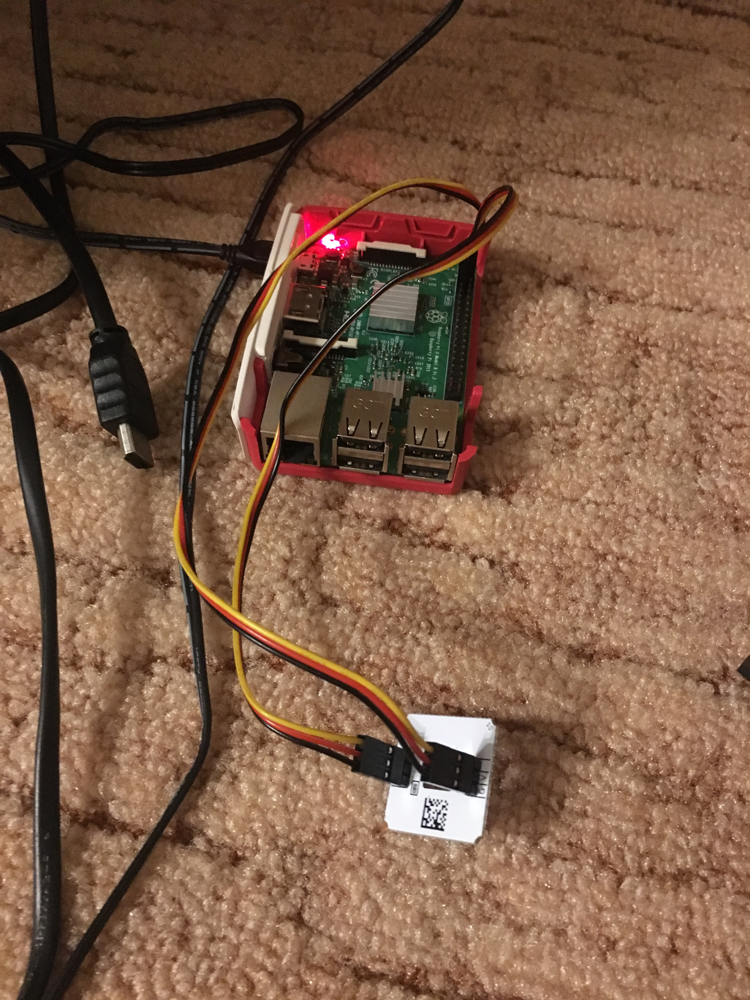

##### Чем занять Raspberry Pi

У многих из нас на полках пылится купленный однажды про запас Raspberry Pi.


Использовать в качестве десктопа или сервера слабый компьютер с очень медленным I/O - удовольствие не из приятных, хотя я и держал его некоторое время как CI сервер, тонкий клиент для RDP и даже запускал на нем полноценную IntelliJ IDEA (*спойлер - она работает как часы, но максимально неторопливо*).


А вот в качестве базы для мелких датчиков - прекрасно. Пусть Arduino правит бал в числе последователей, доступных плат и модулей. Зато у Rasberry Pi полноценный Linux и много больше мощности, а значит в выборе софта ограничений никаких. Большинство железа прекрасно себя чувствует на обеих платформах.


Датчики для множества простых и занимательных вещей, вроде [освещенности](http://amperka.ru/product/troyka-light-sensor), [уровня воды](http://amperka.ru/product/water-level-sensor-straight), [температуры](http://amperka.ru/product/troyka-temperature-sensor), [движения](http://amperka.ru/product/zelo-motion-sensor) и даже [алкоголя](http://amperka.ru/product/troyka-mq3-gas-sensor) продаются в среднем по 150-600 рублей за штуку.


Для себя я собрал домашнюю метеостанцию с интерфейсом в Telegram, получив от этого неожиданно много фана.


Итак, сдуем пыль с малины.


##### Бот в помощь
Ходить по SSH на домашнюю Linux машину неудобно, небезопасно и требует много лишних телодвижений с сетью.


Бот же - идеальный вариант как для выставления интерфейса, так и для предоставления доступа к железу из закрытого сегмента сети:





Все просто. Одна большая кнопка «Сделать хорошо».


Заходите в гости! У меня дома прямо сейчас: http://telegram.me/i_am_at_home_bot.

##### Закупаемся
В моем случае используется [высокоточный метеодатчик](http://amperka.ru/product/troyka-meteo-sensor?utm_source=man&utm_campaign=troyka-meteo-sensor) на сенсоре [SHT3x-DIS](https://www.sensirion.com/en/environmental-sensors/humidity-sensors/digital-humidity-sensors-for-various-applications), работающий на шине I²C в сборке от компании [Амперка](http://amperka.ru), собранный с удобной разводкой:





Гугление дает варианты покупки этого датчика и в виде голой платы - попрактикуйтесь в пайке ножек, если есть желание.


В варианте Амперки датчик приходит сразу с необходимой проводкой. Ничего, кроме самого датчика, в минимальном варианте покупать не нужно. Но если хочется собрать все аккуратнее, чем ворох проводов и голая плата - докупите [Troyka #Структор](http://amperka.ru/product/structor-troyka).


Исходим из того, что Raspberry Pi у нас уже в наличии и на нем установлена Raspbian (полагаю, что и с другими дистрибутивами проблем быть не должно). 


Если же Pi нет, но вдруг очень захотелось, можно докинуть в корзину прямо в Амперке:

- [Raspberry Pi 3 Model B+](http://amperka.ru/product/raspberry-pi-3-model-b-plus)
- [Прозрачный корпус](http://amperka.ru/product/rpi-case-clear)
- [SD карта на 16 Гб с установленной Raspbian](http://amperka.ru/product/raspbian-micro-sd-card) (вариант не лучший, так как карта медленная и дорогая для 16 Гб, но зато сразу подготовленная)
- [Блок питания](http://amperka.ru/product/usb-power-plug-3a)


На Яндекс.Маркете можно собрать необходимое чуть дешевле вместе с [более симпатичным оригинальным корпусом](https://www.raspberrypi.org/products/raspberry-pi-3-case) и [блоком питания](https://www.raspberrypi.org/products/raspberry-pi-universal-power-supply), а также взять быструю microSD карту (советую не ниже UHS Speed Class 1).


Важно не сэкономить на блоке питания. Хотя Raspberry Pi может работать и от power bank, и от любой зарядки - при вполне обычных нагрузках ядро начнет регулярно ругаться на undervoltage.


##### Подключаем датчик
Из обязательной распиновки (и в сборке от Амперки) датчик имеет:

- питание (*04 DC Power 5v*),
- землю (*06 Ground*),
- пин ввода/вывода данных (*03 SDA*),
- пин тактирования шины (*05 SCL*). 


В стандартной разводке Raspberry Pi датчик получится подключить двумя трехпроводными шлейфами, либо четырьмя одинарными проводами «мама-папа»:





В собранном виде:





Подключаемся к Pi по SSH и включаем шину I²C:
```
sudo raspi-config
# Далее в интерфейсе:
5 - Interfacing Options - Configure connections to peripherals
P5 I2C - Enable/Disable automatic loading of I2C kernel module 
Would you like the ARM I2C interface to be enabled? - Yes
```

##### Проверяем корректность подключения
Копируем скрипт на Pi:
<script src="https://gist.github.com/axelrodvl/d1ce721c2851c8aaa413f337bff418f5.js"></script>

При правильном подключении получаем данные:
```
➜  python meteoSensor.py 
Temperature in Celsius is : 17.80 C
Temperature in Fahrenheit is : 64.05 F
Relative Humidity is : 27.78 %RH
```

##### Создаем Telegram бота
Открываем Telegram и добавляем бота [BotFather](https://core.telegram.org/bots#3-how-do-i-create-a-bot).


При создании нового бота необходимо выбрать ему имя и адрес, добавить в контакты и сохранить полученный Access Token вида: 
```
111111111:XXX-XXXXXXXXXXXXXXXXXXXXXXXXXXXXXXX
```

##### Устанавливаем (или разрабатываем) необходимый софт
Для работы с железом на Raspberry Pi часто используют Python, но под все популярные языки программирования обязательно есть удобная библиотека для работы либо с GPIO конкретно Raspberry Pi, либо для работы с конкретной шиной (нам нужна I²C).


Особо отмечу [Control Everything Community](https://github.com/ControlEverythingCommunity) - замечательный сборник примеров работы с огромным числом различных чипов, притом сразу на нескольких популярных языках и под большинство популярных платформ помимо Rasbperry Pi. 


Я разработал решение на Java с использованием:

- [Spring Boot](https://spring.io/projects/spring-boot) - в представлении не нуждается (а если нуждается, то Java вам скорее всего совсем не близка)
- [Telegram Bot Java Library](https://github.com/rubenlagus/TelegramBots) - удобная и простая библиотека для ботов
- [Pi4J :: Java I/O Library for Raspberry Pi](https://github.com/Pi4J/pi4j) - швейцарский нож для шин Raspberry Pi
- [Control Everything Community / SHT31](https://github.com/ControlEverythingCommunity/SHT31/blob/master/Java/SHT31.java) - работа с датчиком


##### Запускаем

#### 1. Бинарник:
- Загружаем [сборку](raspberry-pi-meteo/raspberry-pi-meteo-bot.jar) и копируем на Raspberry Pi
- Устанавливаем Java

	```
	sudo apt-get update
	sudo apt-get install -y galternatives openjdk-8-jdk
	```
- Запускаем, подставив в параметры ранее полученный Access Token бота в Telegram:

	```
	java -jar raspberry-pi-meteo-bot.jar --telegram.bot.token=111111111:XXX-XXXXXXXXXXXXXXXXXXXXXXXXXXXXXXX
	```
- Открываем Telegram и наслаждаемся!

#### 2. Из исходников:
- Копируем [репозиторий](https://github.com/axelrodvl/raspberry-pi-meteo-bot.git) с GitHub:
	
	```
	git clone -b sht3x_only https://github.com/axelrodvl/raspberry-pi-meteo-bot.git
	cd raspberry-pi-meteo-bot
	```
- В `src/main/resources/application.properties` можно при желании сразу вставить нужный `telegram.bot.token`
- Собираем, копируем и запускаем:

	```
	mvn clean install
	scp target/raspberry-pi-meteo-bot-0.2.0.jar pi@address:~
	ssh pi@address 'nohup java -jar raspberry-pi-meteo-bot-0.1.0.jar &> meteo-bot.out&'
	```

	В качестве бонуса - в master ветке репозитория бот расширен поддержкой датчика углекислого газа. 


Погодная станция готова, приятного использования!